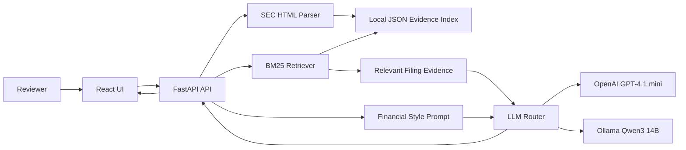

# Evidence Alpha

Evidence Alpha is an Analyst Copilot demo for asking questions over SEC filings. Reviewers can upload one or many filings, ask questions across all indexed documents, see chat history, inspect citations, and check service health from the browser.

The easiest way to run the project is with Docker. Docker starts the full app as one service: FastAPI backend plus the built React frontend.

## Published Demo

- Published app: [https://evidence-alpha.onrender.com](https://evidence-alpha.onrender.com)
- Health check: [https://evidence-alpha.onrender.com/health](https://evidence-alpha.onrender.com/health)
- API docs: [https://evidence-alpha.onrender.com/docs](https://evidence-alpha.onrender.com/docs)
- API helper page: [https://evidence-alpha.onrender.com/api](https://evidence-alpha.onrender.com/api)
- Render dashboard: [https://dashboard.render.com/web/srv-daam2buk1f9s73as2h5g/events](https://dashboard.render.com/web/srv-daam2buk1f9s73as2h5g/events)

Render free services can sleep after inactivity. If the app is slow on first open, wait 30-60 seconds and refresh.

## What You Need

Install these before running locally:

- Git, to clone the repository.
- Docker Desktop, to run the app with one command.
- Internet access, if using OpenAI.
- Optional: an OpenAI API key for the most accurate hosted/local mode.
- Optional: Ollama plus `qwen3:14b` if you want the free local model.

You do not need to install Python, Node, FastAPI, React, or npm packages manually when using Docker. Docker handles that inside the container.

## How To Run With Docker

1. Clone the project:

```bash
git clone git@github.com:vrize-poc-demo/evidence-alpha.git
cd evidence-alpha
```

2. Build the Docker image:

```bash
docker build -t evidence-alpha .
```

3. Run with OpenAI GPT-4.1 mini:

```bash
docker run --rm -p 8000:8000 \
  -e LLM_PROVIDER=openai \
  -e LLM_MODEL=gpt-4.1-mini \
  -e USE_LLM=true \
  -e OPENAI_API_KEY=your_openai_api_key_here \
  evidence-alpha
```

4. Open the app:

```text
http://127.0.0.1:8000
```

Useful local links:

- App: [http://127.0.0.1:8000](http://127.0.0.1:8000)
- API docs: [http://127.0.0.1:8000/docs](http://127.0.0.1:8000/docs)
- API helper page: [http://127.0.0.1:8000/api](http://127.0.0.1:8000/api)
- Health check: [http://127.0.0.1:8000/health](http://127.0.0.1:8000/health)

If you do not have an OpenAI key, the app will still open, uploads and health checks will work, but OpenAI answers will show a setup message.

## Free Local Qwen Mode

Qwen3 14B is the free local model option. It runs through Ollama on your machine.

1. Install Ollama from [https://ollama.com/download](https://ollama.com/download).

2. Start Ollama:

```bash
ollama serve
```

3. Download Qwen3 14B:

```bash
ollama pull qwen3:14b
```

4. Run Docker connected to your local Ollama:

```bash
docker run --rm -p 8000:8000 \
  -e LLM_PROVIDER=ollama \
  -e LLM_MODEL=qwen3:14b \
  -e OLLAMA_BASE_URL=http://host.docker.internal:11434/v1 \
  -e USE_LLM=true \
  evidence-alpha
```

5. Open Service Health in the app and select `qwen3:14b local`.

Qwen3 14B is free after download and keeps answer generation local. It is slower than OpenAI and may be less accurate on complex financial reasoning. For judged accuracy, OpenAI GPT-4.1 mini is still the recommended model.

## How To Use The App

1. Open the Dashboard and check filing/index status.
2. Open Service Health and confirm the selected model is healthy.
3. Open Upload and add one or many SEC `.htm` or `.html` filings.
4. Watch the global processor complete indexing.
5. Open Ask and ask a question. The app searches all indexed filings automatically.
6. Ask a follow-up question in the same chat.
7. Create a new chat to start with clean chat memory.
8. Open the evidence area to inspect document, page, and supporting text.
9. Open History to return to earlier chats.

Sample question:

```text
What is the FY2018 capital expenditure amount (in USD millions) for 3M?
```

Follow-up:

```text
What page supports that answer?
```

## Project Features

- Dashboard for filing counts, chunk counts, processor activity, chat count, and model health.
- Upload page for single and multiple SEC filing uploads.
- Global processor for queued, processing, complete, and failed upload jobs.
- Ask page with chat-style questions over all uploaded/indexed filings.
- Per-chat follow-up memory, with no sharing across new chats.
- History page for saved browser-local chat sessions.
- Evidence-backed answers with confidence, filing name, page number, and supporting passage.
- Service Health page for backend, filing index, processor, OpenAI, and Ollama/Qwen setup.
- Model selection from Service Health, not inside the chat.
- Document reset flow requiring the reviewer to type `DELETE`.
- Render-ready single Docker service.

## Model Used In This Project

Evidence Alpha supports two answer models:

| Model | Where it runs | Best use | Notes |
| --- | --- | --- | --- |
| OpenAI GPT-4.1 mini | Render and local Docker | Best judged accuracy | Requires `OPENAI_API_KEY`, low cost for a small demo |
| Qwen3 14B | Local only through Ollama | Free/private local mode | No API cost, slower, less reliable for complex financial calculations |

The app does not fine-tune or train model weights. It uses retrieval-augmented generation:

1. Parse and index SEC filing text.
2. Retrieve relevant evidence chunks.
3. Add general financial-analysis style examples.
4. Send evidence and the question to the selected model.
5. Return an answer with citation.

The project does not use hidden answer-key matching for judged answers.

## Tech Stack

- Frontend: React, Vite, lucide-react.
- Backend: FastAPI, Uvicorn, Pydantic.
- Parsing: BeautifulSoup for SEC HTML cleanup.
- Retrieval: local BM25-style keyword retrieval.
- LLM routing: OpenAI API or Ollama-compatible local API.
- Storage: local JSON index, local uploads folder, browser localStorage for chat history.
- Deployment: Docker and Render.

No external database is required for this proof-of-solution.

## Architecture



Storage locations:

- Committed filings: `data/filings`
- Practice questions: `data/practice-questions.jsonl`
- Generated index: `backend/.index/chunks.json`
- Runtime uploads: `backend/uploads`
- Chat history: browser localStorage

## Testing

Run backend smoke test:

```bash
backend/.venv/bin/python scripts/smoke_test.py
```

Run frontend build test:

```bash
cd frontend
npm run build
```

Run UI practice evaluator:

```bash
npm install
npx playwright install chromium
npm run eval:ui -- --model local-qwen3-14b --limit 5 --timeout-ms 180000 --out reports/practice-ui-qwen3-14b-real-sample5.json
```

The project currently has `136` practice questions in `data/practice-questions.jsonl`.

## Internal Documentation

- [Architecture](docs/ARCHITECTURE.md)
- [Feature Guide](docs/FEATURES.md)
- [Model Guide](docs/MODEL_GUIDE.md)
- [Reviewer Guide](docs/REVIEWER_GUIDE.md)
- [API Reference](docs/API_REFERENCE.md)
- [Deployment](docs/DEPLOYMENT.md)
- [Testing](docs/TESTING.md)
- [Demo Script](docs/DEMO_SCRIPT.md)
- [Sample Questions](docs/SAMPLE_QUESTIONS.md)
- [Requirements From Prompt](docs/REQUIREMENTS.md)
- [Approach Note](docs/APPROACH.md)

## API Endpoints

- `GET /api` - helper page with backend links.
- `GET /health` - basic health check.
- `GET /health/services` - detailed health for the UI.
- `GET /models` - supported model choices.
- `GET /local-models/status` - Ollama/Qwen status.
- `POST /local-models/start` - starts Ollama locally when installed.
- `POST /local-models/pull` - downloads Qwen3 14B locally.
- `GET /filings` - indexed filing summaries.
- `GET /processor` - upload/indexing processor jobs.
- `POST /filings/upload` - upload one filing.
- `POST /filings/upload-multiple` - upload multiple filings.
- `POST /documents/delete-all` - delete indexed/uploaded documents after confirmation.
- `POST /ask` - ask a question with optional current-chat context.

## Troubleshooting

If the app opens but answers fail:

- Open Service Health.
- Confirm the selected model is healthy.
- For OpenAI, confirm `OPENAI_API_KEY` is set.
- For Qwen, confirm Ollama is running and `qwen3:14b` is downloaded.
- Confirm filings are indexed on the Dashboard.

If Docker says the port is already in use, stop the old container or run with another port:

```bash
docker run --rm -p 8001:8000 evidence-alpha
```

Then open:

```text
http://127.0.0.1:8001
```
