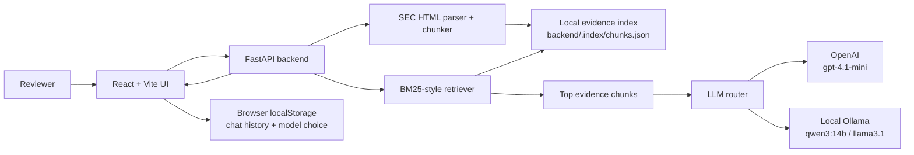
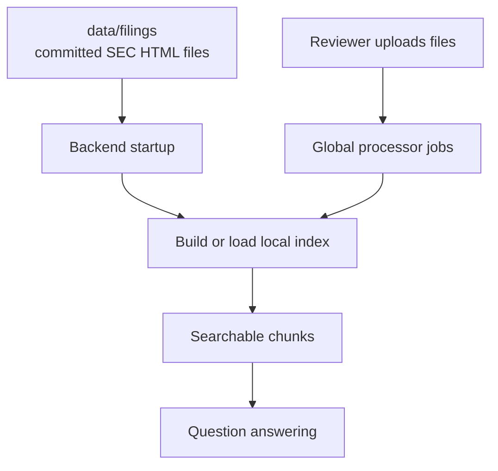
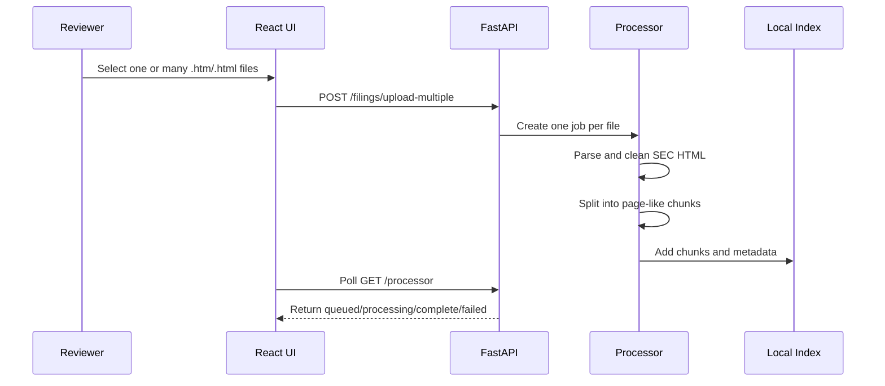
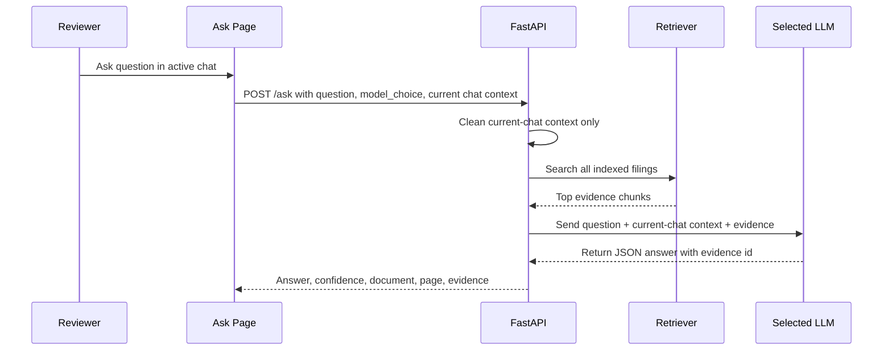
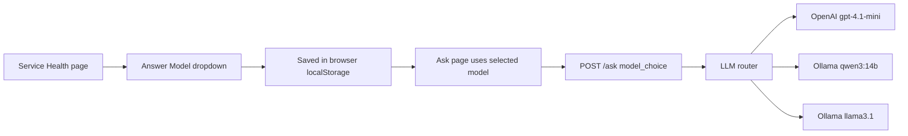
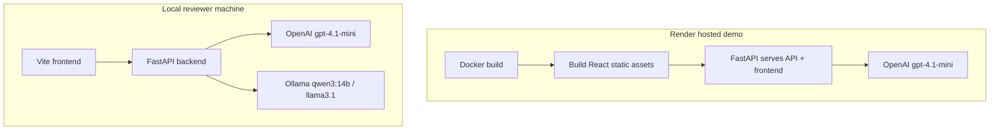

# Architecture

Evidence Alpha is a React + FastAPI retrieval-augmented generation app. It does not train an LLM. It retrieves relevant SEC filing passages first, then asks the selected LLM to answer only from those passages.

## High-Level System

## Main Components

| Layer | Technology | Responsibility |
| --- | --- | --- |
| Web UI | React, Vite, lucide-react | Dashboard, upload, chat, history, health, model selection |
| API | FastAPI, Pydantic | Routes, validation, upload handling, service health, answer orchestration |
| Parser | BeautifulSoup | SEC HTML cleanup and text extraction |
| Index | JSON file | Local searchable filing chunks and metadata |
| Retrieval | BM25-style keyword search | Finds relevant evidence across all indexed filings |
| LLM | OpenAI or Ollama | Generates evidence-grounded answers |
| Browser storage | localStorage | Saves chat sessions and selected model for the reviewer |

## Data Flow

The copied dataset lives in `data/filings`. On first backend startup, the app builds `backend/.index/chunks.json`. Uploaded files are stored under `backend/uploads` and added to the active index.

## Upload Processing

## Question Answering

Important behavior:

- The retriever searches all indexed filings.
- Chat context comes only from the active chat.
- New chats do not use older chat history.
- The LLM must cite supplied filing evidence.
- If evidence is weak, the expected answer is `Not found in the indexed filings.`

## Model Selection

The model selector is intentionally not inside the chat page. This keeps each chat focused on the conversation while Service Health controls the operating mode.

## Service Health

Service Health calls:

- `GET /health`
- `GET /health/services`
- `GET /models`
- `GET /local-models/status`

It shows only the selected model's detailed health. For example, if OpenAI is selected, local Ollama details are not shown as the active model health. If a local model is selected, Ollama setup and model download controls are shown.

## Storage Model

| Data | Location | Notes |
| --- | --- | --- |
| Original filings | `data/filings` | Committed with the repo |
| Practice questions | `data/practice-questions.jsonl` | Used for smoke tests and optional benchmark mode |
| Generated index | `backend/.index/chunks.json` | Rebuilt automatically if missing |
| Uploaded filings | `backend/uploads` | Local runtime files |
| Chat history | Browser localStorage | Per browser and per machine |
| Processor jobs | Backend memory | Runtime-only status |

There is no external database in this proof-of-solution.

## Deployment Architecture

Render should use OpenAI. Local reviewers can use OpenAI or Ollama.

## Accuracy Approach

Evidence Alpha uses a conservative RAG pattern:

1. Search all indexed filings.
2. Select the best evidence chunks.
3. Include current-chat context only for follow-up interpretation.
4. Ask the LLM to answer in strict JSON.
5. Require the answer to cite evidence.
6. Decline when evidence is insufficient.

The production upgrade path should add table-aware extraction, hybrid search, embeddings, reranking, and a second verifier pass that checks numbers against citations.
